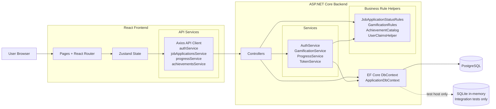

# JobQuest Architecture

## High-Level Architecture Overview

JobQuest is a full-stack web application with a React frontend and an ASP.NET Core backend. The frontend renders routed pages, manages session and domain state with Zustand, and talks to the backend over HTTP using Axios. The backend exposes REST endpoints, validates requests, authenticates users with JWT bearer tokens, applies business rules, and persists data through Entity Framework Core to PostgreSQL.

## Mermaid Architecture Diagram

This diagram is intentionally non-linear. In the final backend, controllers sometimes use simple rule helpers or `ApplicationDbContext` directly for straightforward validation and CRUD work, while services handle larger business flows such as authentication, gamification side effects, progress aggregation, and token creation.

## Frontend Architecture

### Entry and Routing

- `frontend/src/main.tsx` mounts the React app
- `frontend/src/App.tsx` defines the route tree
- `frontend/src/components/ProtectedRoute.tsx` protects routes that require an authenticated session

The frontend is page-oriented. Most screens live in `frontend/src/pages` and compose the main UI directly.

### Pages Layer

The main page modules are:

- `LoginPage.tsx`
- `RegisterPage.tsx`
- `DashboardPage.tsx`
- `ApplicationsOverviewPage.tsx`
- `ApplicationsPage.tsx`
- `ProgressPage.tsx`
- `AchievementsPage.tsx`

Responsibilities of the pages layer:

- render route-specific UI
- call store actions on mount and on user interaction
- display request, validation, and loading state
- connect navigation, theme switching, and domain data

### Services Layer

The frontend service modules in `frontend/src/services` wrap backend HTTP calls:

- `api.ts` creates the shared Axios client
- `authService.ts` handles auth requests and session persistence
- `jobApplicationsService.ts` handles job application CRUD
- `progressService.ts` handles progress and weekly-goal requests
- `achievementsService.ts` handles achievement listing

### State Management Approach

The application uses Zustand for shared state.

Stores:

- `useAuthStore.ts`
- `useJobApplicationsStore.ts`
- `useProgressStore.ts`
- `useAchievementsStore.ts`

This state layer is responsible for:

- tracking the active auth session and current user
- holding loaded applications, progress, and achievement data
- storing request status and error messages
- resetting related client state after logout or authentication failure

### Theme Switching

Theme switching is handled by `frontend/src/hooks/useDashboardTheme.ts`. It stores the selected theme in `localStorage` and sets `document.body.dataset.dashboardTheme`, which is then used by `frontend/src/index.css` and `frontend/src/App.css`.

## Backend Architecture

### Application Startup

`backend/Program.cs` configures:

- PostgreSQL EF Core connection
- controllers and JSON options
- CORS
- health checks
- OpenAPI and Scalar
- password hashing service registration
- auth, token, progress, and gamification services
- JWT bearer authentication and authorization

### Controllers Layer

The API surface is implemented with controller classes in `backend/Controllers`.

- `AuthController.cs`: registration, login, current-user lookup
- `JobApplicationsController.cs`: user-specific CRUD and status transition enforcement
- `ProgressController.cs`: progress, summary, weekly-goal progress, weekly-goal updates
- `AchievementsController.cs`: achievement listing for the current user

### Services Layer

The main service responsibilities are split as follows:

- `AuthService.cs`: registration, password hashing, credential verification, token response creation
- `TokenService.cs`: JWT claim and signature creation
- `GamificationService.cs`: points, streaks, level changes, achievement unlocking
- `ProgressService.cs`: summary queries, weekly goal calculations, achievement response mapping

### DTO Layer

Request and response DTOs live in `backend/DTOs` and define the backend contract consumed by the frontend.

Responsibilities of the DTO layer:

- define request validation rules
- define response shapes returned by controllers
- keep API payloads separate from EF Core entities

### Models and Rule Helpers

The backend domain model is implemented in `backend/Models`, while reusable business rules live in `backend/Helpers`.

Important helper modules:

- `GamificationRules.cs`
- `JobApplicationStatusRules.cs`
- `AchievementCatalog.cs`
- `UserClaimsHelper.cs`
- `CorsOriginNormalizer.cs`

## Database Layer

The backend communicates with PostgreSQL through `ApplicationDbContext` in `backend/Data/ApplicationDbContext.cs`.

Key database integration details:

- EF Core entities are mapped in `OnModelCreating`
- relationship rules and unique constraints are configured there
- PostgreSQL is used at runtime through `UseNpgsql`
- migrations in `backend/Migrations` capture schema history
- integration tests replace PostgreSQL with in-memory SQLite via `backend.Tests/Integration/TestWebApplicationFactory.cs`

## Key Data Flow

### Authentication flow

1. The frontend submits credentials through `authService.ts`.
2. `AuthController` delegates registration or login to `AuthService`.
3. The backend hashes or verifies credentials, creates a JWT, and returns an authenticated session payload.
4. The frontend stores the session, and the shared Axios client attaches the bearer token on later protected requests.

### Application and progress flow

1. Routed pages call actions from the relevant Zustand stores.
2. Store actions call the frontend service modules, which send JSON requests to the backend API.
3. Controllers validate the request, scope data access to the authenticated user, and delegate rule-heavy work to services and helper classes.
4. The backend updates or queries PostgreSQL through `ApplicationDbContext`.
5. The frontend stores refresh local state and re-render the affected pages.

## Cross-Cutting Design Choices

- User-specific data is enforced through authenticated requests and user-scoped queries.
- Business rules for statuses, rewards, streaks, and achievements are centralized in backend helpers and services rather than in frontend pages.
- Shared frontend state is kept in Zustand so dashboard, applications, progress, and achievements stay consistent across routes.
- API contracts are defined through backend DTOs and consumed through dedicated frontend service modules.
- Controllers are not forced through a single chain. Simple validation or entity updates can use helpers and `ApplicationDbContext` directly, while services are used for multi-step business workflows with side effects.

